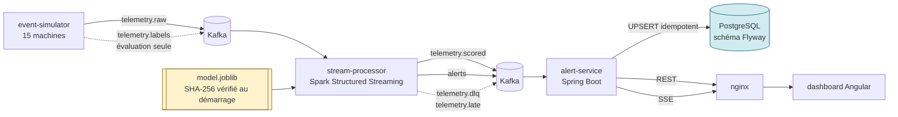

# Plateforme de détection d'anomalies en temps réel

Détection d'anomalies sur la télémétrie de machines industrielles : un flux de
capteurs entre par Kafka, un job Spark Structured Streaming l'agrège en fenêtres
de 60 secondes et le score avec un modèle entraîné hors ligne, les alertes sont
persistées de façon idempotente dans PostgreSQL, et un dashboard Angular les
affiche en direct.

**Les données sont entièrement simulées.** Aucune mesure de ce dépôt ne provient
d'une machine réelle. C'est écrit ici, en tête, parce que tout le reste du
document se lit avec cette réserve — et parce que c'est la première question que
mérite un projet qui affiche des métriques.

Toutes les valeurs chiffrées de ce README sont issues d'exécutions réelles et
recopiées depuis les rapports générés (`ml-training/reports/model-report.md`,
`docs/10-phase-3-streaming.md`). Aucune n'est estimée.

---

## 1. Présentation du projet

Une chaîne complète, de la génération de l'événement à l'écran de l'opérateur :

| Composant | Rôle | Technologie |
|---|---|---|
| `event-simulator` | Génère la télémétrie et la vérité terrain | Python 3.11 |
| `ml-training` | Entraîne, évalue et publie le modèle | scikit-learn 1.5.2 |
| `stream-processor` | Fenêtrage, features, scoring, alerting | PySpark 3.5 |
| `alert-service` | Ingestion idempotente, API REST, flux SSE | Spring Boot 3.3.5 / Java 17 |
| `dashboard` | Interface opérateur | Angular 21 |
| `libs/telemetry-core` | Contrats et features partagés | Python |

Projet personnel réalisé en six phases, chacune documentée avec ses décisions,
ses mesures et ses limites. Neuf ADR consignent les arbitrages structurants.

## 2. Problématique

Dans un atelier, une dégradation mécanique est visible dans les signaux bien
avant la panne — mais elle est noyée dans le bruit normal du procédé. Les seuils
fixes traditionnels posent un dilemme : réglés serré, ils noient l'opérateur
sous les fausses alertes ; réglés large, ils laissent passer la panne.

Trois difficultés techniques structurent le projet :

1. **Le temps.** Un événement capteur arrive en retard, dans le désordre, ou pas
   du tout. Compter sur l'heure d'arrivée donne des résultats qui dépendent de
   l'état du réseau. Il faut raisonner sur le **temps d'événement**.
2. **La livraison.** Un pipeline distribué qui ne perd rien livre
   nécessairement certains messages plusieurs fois. Il faut rendre les rejeux
   inoffensifs plutôt que prétendre qu'ils n'existent pas.
3. **L'évaluation.** Sur des données déséquilibrées, presque toutes les
   métriques classiques flattent un modèle médiocre.

## 3. Objectifs

- Détecter des anomalies sur un flux continu, avec une latence de l'ordre de la
  minute.
- Ne perdre aucune donnée, et ne créer aucun doublon en base.
- Rendre chaque alerte **explicable** : quel modèle, quelle version, quels
  signaux ont contribué.
- Pouvoir défendre chaque choix technique par une mesure, pas par une intuition.
- Démarrer depuis un clone propre en **une seule commande**.

## 4. Architecture

Six topics Kafka, partitionnés par `machine_id` pour garantir l'ordre par
machine ; un job Spark à état ; un service Spring Boot ; un SPA Angular derrière
nginx.

Les partitions sont figées : **Kafka ne peut jamais réduire un nombre de
partitions**, et l'augmenter change `hash(clé) % partitions`, ce qui casse
l'ordre par clé à la frontière.

| Topic | Partitions | Rétention | Rôle |
|---|---|---|---|
| `telemetry.raw` | 6 | 7 j | Télémétrie brute |
| `telemetry.scored` | 6 | 3 j | Fenêtres scorées (52 features) |
| `alerts` | 3 | 30 j | Alertes |
| `telemetry.labels` | 3 | 90 j | Vérité terrain — **jamais** jointe au runtime |
| `telemetry.dlq` | 1 | 30 j | Rebut, relu par un humain |
| `telemetry.late` | 1 | 7 j | Événements arrivés après le watermark |

## 5. Schéma d'architecture



## 6. Flux de données

1. **Génération.** Le simulateur produit 15 machines avec un modèle physique et
   injecte 7 types d'anomalie. La vérité terrain part sur un **topic séparé**,
   et n'est jamais jointe à la télémétrie au runtime — c'est ce qui empêche la
   fuite d'information.
2. **Fenêtrage.** Spark agrège en fenêtres de 60 s glissant toutes les 10 s, sur
   le **temps d'événement**, avec un watermark de 90 s.
3. **Features.** 52 features par fenêtre, calculées par une spécification
   partagée avec l'entraînement — un test de conformité l'impose.
4. **Scoring.** Le modèle est chargé une fois par exécuteur, après vérification
   de son empreinte.
5. **Alerting.** Un opérateur à état déduplique : une dégradation continue
   produit **une** alerte, pas une par fenêtre.
6. **Persistance.** `alert-service` consomme et écrit en `INSERT … ON CONFLICT`.
7. **Affichage.** REST pour l'historique, SSE pour le direct.

## 7. Stack technique

| Domaine | Choix | Version |
|---|---|---|
| Messagerie | Apache Kafka (KRaft, sans ZooKeeper) | 3.9.0 |
| Streaming | PySpark Structured Streaming | 3.5 |
| ML | scikit-learn | 1.5.2 |
| Backend | Spring Boot / Java | 3.3.5 / 17 |
| Base | PostgreSQL, schéma géré par Flyway | 16.4 |
| Frontend | Angular (standalone + signals), Chart.js | 21.2.23 / 4 |
| API | springdoc-openapi | 2.6.0 |
| Conteneurs | Docker Compose | — |

**Ce qui a été délibérément écarté** : Kubernetes, MLflow, Redis, un Schema
Registry, WebSocket, NgRx. Chacun résout un problème que ce projet n'a pas ; les
ajouter aurait produit de l'architecture décorative.

## 8. Fonctionnalités

- Génération de télémétrie déterministe (graine) en temps réel ou en rejeu accéléré
- Fenêtrage temps-d'événement avec watermark et gestion des données tardives
- Détection d'anomalies avec seuil calibré sur un **budget d'alertes**
- Déduplication des alertes par épisode
- Persistance idempotente, prouvée par la base et non par du code Java
- Rejeu, reprise sur crash depuis checkpoint
- Rebut (DLQ) rejouable, avec cause de rejet
- API REST paginée, filtrée et triée côté base
- Flux SSE avec reprise par curseur (`Last-Event-ID`)
- Acquittement avec verrouillage optimiste optionnel
- Courbes capteur avec anomalies marquées
- Documentation OpenAPI générée depuis le code

## 9. Détection d'anomalies et évaluation ML

### Comment le jeu de données a été construit

| | |
|---|---|
| Lignes de télémétrie | **2 591 998** |
| Lignes d'étiquettes | 33 579 |
| Machines | 15 |
| Fenêtre temporelle | 2026-09-05T00:10Z → 2026-09-07T00:10Z |
| Graine du simulateur | 424242 |
| Doublons retirés / échecs de décodage | 0 / 0 |
| SHA-256 de `samples.parquet` | `301c7ce070465afe…` |

**Découpage temporel, jamais aléatoire.** Deux fenêtres de part et d'autre d'une
coupure aléatoire sont quasi identiques : c'est une fuite. La coupure est
appliquée aux échantillons **avant** le fenêtrage, pour qu'aucune fenêtre ne
chevauche une frontière.

| Split | Fenêtres | Heures | Fenêtres anormales | Prévalence | Épisodes |
|---|---|---|---|---|---|
| train | 21 178 | 27,98 | 254 | 0,0120 | 126 |
| validation | 45 052 | 10,00 | 944 | 0,0210 | 52 |
| test | 45 460 | 10,00 | 759 | **0,0167** | 42 |

### Modèles comparés

Tous partagent le même prétraitement, pour qu'un écart de résultat soit un écart
**entre modèles** et non entre pipelines. La référence n'est pas handicapée.

| Modèle | PR-AUC | Précision | Rappel | F1 | Rappel épisode |
|---|---|---|---|---|---|
| `three_sigma` (référence) | **0,6704** | **0,9839** | 0,4822 | **0,6472** | 0,4286 |
| `elliptic_envelope` | 0,3812 | 0,5020 | 0,8076 | 0,6192 | 1,0000 |
| **`one_class_svm`** (retenu) | 0,3369 | 0,4461 | 0,2345 | 0,3074 | **0,8810** |
| `three_sigma_all_features` | 0,3424 | 0,4894 | 0,2134 | 0,2972 | 0,7381 |
| `isolation_forest` | 0,0991 | 0,1014 | 0,0567 | 0,0727 | 0,4286 |

### Le modèle retenu, et pourquoi — y compris ce que cela coûte

**La référence 3-sigma bat le modèle retenu** sur le PR-AUC (0,6704 contre
0,3369) et sur la précision (0,9839 contre 0,4461). Le dire est plus utile que
le taire : sur une métrique par fenêtre, une règle statistique simple est
meilleure.

`one_class_svm` est retenu pour une seule raison, **le rappel par épisode :
0,8810 contre 0,4286**. Ce qui compte en supervision d'atelier est de ne pas
rater une panne, pas de classer correctement chaque fenêtre de 60 s. 3-sigma
détecte 18 épisodes sur 42 ; `one_class_svm` en détecte 37.

`elliptic_envelope` atteint pourtant un rappel épisode de 1,0000, et il est
**écarté** : sa covariance est de rang déficient (45 colonnes sur 47,
conditionnement 3,284e+47). La distance de Mahalanobis repose alors sur une
matrice qu'on ne peut pas inverser de façon fiable. scikit-learn ne refuse pas
une covariance singulière — il émet un avertissement et continue, ce qui est
pire qu'échouer, car le modèle se charge ensuite et score comme si de rien
n'était.

### Le seuil

Choisi sur la **validation**, jamais sur le test, et à partir d'un **budget
d'alertes** (0,5 alerte par machine et par heure) plutôt qu'au maximum du F1.

| | Quantile | Seuil | Alertes/machine/h | F1 fenêtre | Rappel épisode |
|---|---|---|---|---|---|
| Retenu (budget) | 0,99 | **0,9928** | 0,493 | 0,3312 | 0,8462 |
| Maximisant le F1 | 0,97 | 0,9751 | 0,667 | 0,5540 | 0,9808 |

Le second est meilleur sur les deux métriques affichées. Il est écarté parce
qu'il dépasse le budget : un opérateur qui reçoit trop d'alertes cesse de les
lire, et un détecteur ignoré a un rappel effectif de zéro.

### Résultats mesurés sur le test

| | |
|---|---|
| Seuil | 0,9928 |
| Précision / Rappel / F1 (fenêtre) | 0,4461 / 0,2345 / 0,3074 |
| PR-AUC | 0,3369 |
| Matrice de confusion | TP 178, FP 221, TN 44 480, FN 581 |
| Épisodes détectés | **37 / 42** |
| Rappel épisode | 0,8810 |
| Latence médiane de détection | **60,3 s** |
| Part de faux positifs | **55,39 %** des alertes |

**Plus d'une alerte sur deux est un faux positif.** C'est le prix du rappel
épisode, et c'est un chiffre qui doit être affiché, pas dilué.

Les épisodes manqués ne sont pas répartis au hasard : `OVERHEAT` n'est détecté
qu'à 0,2500 (1 sur 4), alors que `BEARING_WEAR`, `POWER_SURGE`, `SENSOR_STUCK`
et `SENSOR_DROPOUT` le sont à 1,0000. La cause est mesurée : la durée médiane
d'un épisode manqué est de **10,0 s** contre **106,0 s** pour un épisode
détecté. Un pic court se dilue dans une fenêtre de 60 s.

## 10. Streaming temps réel

### Temps d'événement, watermark, données tardives

Le fenêtrage utilise l'instant où la mesure a été **prise**, pas celui où elle
est arrivée. Le watermark est la borne de retard tolérée : au-delà, l'état d'une
fenêtre est libéré et un événement encore plus tardif ne peut plus la corriger.

**90 s, et non les 30 s du design initial** (ADR-003). Le simulateur met une
machine en tampon pendant 20 à 75 s lors d'une coupure et ajoute jusqu'à 9 s de
gigue : le pire cas configuré est d'environ 84 s. Cette valeur est **spécifique
à cet environnement simulé** ; une usine réelle demanderait de la recalibrer par
la mesure.

Les événements arrivés trop tard ne sont pas jetés en silence : ils partent sur
`telemetry.late`. Vérifié de bout en bout — un message publié 300 s après son
temps d'événement y arrive avec un retard mesuré de **300,0 s exactement**.

### Maturité des fenêtres : le défaut que seule l'exécution temps réel a révélé

Watermark et maturité ne sont **pas** la même chose, et les confondre a produit
le défaut le plus instructif du projet (ADR-004).

- Le **watermark** est une borne globale de retard.
- La **maturité** est une propriété locale : cette fenêtre-ci, pour cette
  machine-ci, a-t-elle assez de couverture pour être scorée ?

En mode `update`, une fenêtre est republiée à chaque micro-batch pendant qu'elle
se remplit. Elle était donc scorée alors qu'elle était encore partielle. La
mesure :

| Échantillons dans la fenêtre | Fenêtres | Déclarées anormales |
|---|---|---|
| 30 – 39 | 383 | **383 (100,0 %)** |
| 40 – 49 | 351 | 335 (95,4 %) |
| 50 – 59 | 322 | 151 (46,9 %) |
| **60 et plus (complète)** | 292 | **3 (1,0 %)** |

Une fenêtre incomplète était déclarée anormale à 100 % contre 1,0 % pour une
fenêtre complète. Le modèle n'était pas en cause : on lui présentait des
agrégats calculés sur un tiers des données.

La correction a demandé **deux itérations**, et la première a été publiée comme
insuffisante plutôt que maquillée : elle a supprimé 93 % des émissions anormales
mais laissé **15 alertes sur 15 machines**. La mesure a expliqué pourquoi —
toutes portaient le même `window_start`, avec exactement 44 échantillons : des
fenêtres d'ouverture tronquées **en tête**, que la règle ne regardait pas. La
règle finale est symétrique (tête et queue). Résultat : 2 émissions anormales
sur 322, et **1 alerte au lieu de 16**.

### Checkpoint et reprise — testé par un vrai crash

| | |
|---|---|
| Signal | `SIGKILL`, code de sortie **137** |
| État avant crash | `telemetry.scored` = 14 635, `alerts` = 99 |
| Lots avant / après | validation 8 → **9**, scoring 6 → **7**, alerting 5 → **6** |
| Code de sortie de la reprise | **0**, **0 erreur** |
| Fenêtres perdues | **0** |
| Livraisons dupliquées | **8** |

Les 8 doublons sont **attendus**, pas accidentels : c'est la contrepartie de
l'at-least-once, et c'est précisément ce que l'idempotence en base absorbe.

### At-least-once — et jamais exactly-once

Le pipeline garantit **at-least-once**. Combiné à une écriture idempotente, cela
donne un effet **effectively-once à la persistance**. Ce n'est pas de
l'exactly-once, et ce projet ne le revendique nulle part : Kafka, Spark et
PostgreSQL ne partagent pas de transaction.

## 11. Backend

### Idempotence garantie par PostgreSQL, pas par du code Java

L'identifiant d'alerte est un **UUIDv5 déterministe** dérivé de
`(machine_id, window_start, model_name, model_version)`. Le même incident produit
donc toujours le même identifiant, quel que soit le nombre de rejeux.

```sql
INSERT INTO alert (...) VALUES (...)
ON CONFLICT (id) DO UPDATE
   SET severity = EXCLUDED.severity, ..., updated_at = now()
 WHERE alert.status = 'NEW'
RETURNING (xmax = 0)
```

`xmax = 0` sur une ligne réellement insérée, non nul sur une ligne mise à jour :
la base **dit elle-même** si c'était un doublon. Un `existsById()` suivi d'un
`save()` aurait été un test-puis-agit — deux threads consommateurs passent le
test en même temps, et le perdant échoue sur la contrainte, transformant une
opération censée être idempotente en erreur. Vérifié avec **huit threads
concurrents dont exactement un insère**.

### Erreurs, rejeux et rebut

Une distinction que la classification doit tenir : une **erreur de données** est
définitive et part au rebut ; une **panne d'infrastructure** est transitoire et
doit être réessayée. Router une panne de base vers la DLQ y jetterait des
alertes valides pendant tout l'incident. Un doublon n'est **jamais** traité
comme une erreur réessayable.

Le schéma appartient à **Flyway** (V1, V2, V3) et à lui seul. JPA est en
`ddl-auto: validate` : une entité qui diverge de la migration fait échouer le
démarrage au lieu d'altérer une table en silence. Aucun script SQL parallèle
n'existe dans ce dépôt — un second système de DDL garantirait la divergence.

### REST et SSE

Six endpoints, documentés par OpenAPI **généré depuis les contrôleurs** :

| Endpoint | Rôle |
|---|---|
| `GET /api/v1/alerts` | Liste paginée, filtrée, triée (tri sur liste blanche) |
| `GET /api/v1/alerts/{alertId}` | Détail : score, contributeurs, modèle, historique |
| `POST /api/v1/alerts/{alertId}/acknowledge` | Acquittement, `expectedVersion` optionnel |
| `GET /api/v1/alerts/stats` | Agrégats calculés par PostgreSQL |
| `GET /api/v1/machines/{code}/telemetry` | Courbe capteur par fenêtre |
| `GET /api/v1/alerts/stream` | Flux SSE (`text/event-stream`) |

Console interactive : `http://localhost:8081/swagger-ui.html`.

Un test compare le document généré à la **table de routage de Spring**, dans les
deux sens : un chemin documenté mais non routable, ou routable mais non
documenté, fait échouer le build. La documentation ne peut donc pas diverger du
code.

Les erreurs sont des `ProblemDetail` RFC 9457, toujours porteuses d'un `traceId`
corrélé aux journaux.

Le flux SSE émet `alert.created`, `alert.updated` et un `heartbeat` toutes les
15 s. Chaque événement porte `id: <event_seq>`, une séquence monotone servant de
curseur de reprise — l'UUID de l'alerte ne pourrait pas jouer ce rôle, un
identifiant aléatoire n'ordonnant rien. Le heartbeat n'est pas décoratif : sans
trafic, un proxy ferme une connexion inactive au bout de 30 à 60 s et le
dashboard cesse de se mettre à jour **tout en s'affichant comme connecté**.

## 12. Dashboard

Trois pages : flux temps réel, historique filtrable, détail d'alerte avec courbe
capteur et formulaire d'acquittement. Angular 21 en composants standalone et
signaux, sans NgRx.

**Persistance des fenêtres de télémétrie (D-41).** Avant la Phase 5, aucune
courbe n'était affichable honnêtement : `telemetry.raw` n'est persisté nulle
part, et le champ `features` de l'alerte est toujours vide. `alert-service`
consomme donc `telemetry.scored` sous **son propre groupe de consommateurs** —
ce topic porte environ deux ordres de grandeur de trafic de plus que `alerts`
(11 342 mises à jour de fenêtre contre 25 alertes sur les mêmes deux heures
mesurées), et la file de l'opérateur ne doit jamais attendre derrière des
données de graphique.

Deux règles que le graphique respecte :

- **une valeur manquante casse la ligne** (`spanGaps: false`). Un capteur en
  panne laisse un trou visible plutôt qu'un segment droit. Tracer à travers le
  trou inventerait une mesure. Un capteur muet est stocké `NULL`, jamais `0`.
- **les anomalies sont marquées, pas déduites.** Les points rouges sont les
  fenêtres que le modèle a signalées, lues telles quelles.

Ce que la courbe **est** : la moyenne par fenêtre calculée par le pipeline. Ce
qu'elle n'est **pas** : une trace capteur brute. La légende le précise à
l'écran.

Les alertes sont indexées par `alertId` dans une `Map` et toujours mises à jour,
jamais empilées — ce qui couvre les trois causes de répétition : livraison
at-least-once, rejeu à la reconnexion, et recouvrement entre REST et SSE.

nginx sert le SPA et proxifie `/api`, donc le navigateur ne voit **qu'une seule
origine** : il n'y a pas de CORS à configurer, le problème est supprimé plutôt
que contourné (D-42).

## 13. Décisions techniques importantes

| # | Décision | Justification courte |
|---|---|---|
| ADR-001 | Le job vérifie l'artefact au démarrage | Empreinte, version scikit-learn, jeu de features, ordre des colonnes. Scorer avec un artefact incompatible produit des résultats plausibles et faux |
| ADR-002 | DLQ réservée aux erreurs de données | Y router une panne d'infra jetterait des messages valides |
| ADR-003 | Watermark 90 s, mode `update` | Calibré sur le comportement mesuré du simulateur |
| ADR-004 | Maturité ≠ watermark | Une fenêtre partielle était anormale à 100 % contre 1,0 % |
| ADR-005 | Idempotence par `ON CONFLICT … RETURNING (xmax = 0)` | La base garantit, le code ne vérifie pas |
| ADR-006 | Erreurs classées transitoire / définitive | Confondre les deux perd des alertes ou bloque une partition |
| ADR-007 | Trois tables, pas six | `production_line` n'a aucun attribut propre |
| ADR-008 | Persister `telemetry.scored` | Sans cela, toute courbe aurait été fabriquée |
| ADR-009 | Versionner `model.joblib` (217 Kio) | Sans lui, « une commande » était faux : l'artefact n'est pas reconstructible depuis un clone |
| D-49 | Les profils Compose restent | `up` laisse la pile passive : produire des données est un acte délibéré |
| D-50 | OpenAPI généré, pas écrit | Un fichier écrit à la main diverge dès la première modification |

Le détail complet est dans [`docs/adr/`](docs/adr/) et
[`docs/09-open-decisions.md`](docs/09-open-decisions.md).

## 14. Lancement du projet

### Prérequis

**Docker Desktop avec le moteur Linux, et un shell POSIX** (Git Bash convient
sous Windows). Rien d'autre : aucun JDK, aucun Python, aucun Node n'est
nécessaire sur la machine — tout est construit en conteneur.

`make` est **facultatif**, et ce n'est pas une précaution de style : il n'est
pas installé par défaut sous Windows, et il ne l'était pas sur la machine où ce
projet a été développé. Chaque cible se résume donc à une seule ligne
directement exécutable, donnée à côté de la commande `make` partout ci-dessous.

### Préparation

```sh
git clone <url-du-depot>
cd real-time-anomaly-detection-platform

make env          # ou :  cp .env.example .env
```

`.env` contient uniquement des valeurs de développement. `POSTGRES_PASSWORD` est
un remplaçant explicite (`change-me-locally`) : **aucun secret réel n'est
versionné**, et une valeur committée dans git doit être considérée comme
compromise pour toujours, l'historique étant immuable.

### Démarrage

```sh
make demo         # ou :  ./scripts/demo.sh
```

Une seule commande, à partir d'un clone propre. La première exécution construit
quatre images.

### Les autres commandes

| `make` | Équivalent direct | Effet |
|---|---|---|
| `make demo` | `./scripts/demo.sh` | Tout construire, démarrer, produire des données |
| `make bootstrap` | `./scripts/bootstrap.sh` | Vérifier artefact, topics, migrations, readiness |
| `make up` | `docker compose --env-file .env -f infra/docker-compose.yml up -d` | Démarrer la pile **passive** |
| `make down` | `… down` | Arrêter, conserver les volumes |
| `make clean` | `… down -v` | Arrêter **et supprimer** les volumes |
| `make check-env` | `python scripts/check_env_example.py` | Vérifier `.env.example` contre compose |
| `make help` | — | Lister toutes les cibles |

`./scripts/bootstrap.sh --model-only` vérifie le seul artefact, sans démarrer
Docker : c'est la vérification la plus rapide qu'un clone est complet.

**Pourquoi `make demo` et pas `docker compose up`** : le simulateur et le job
Spark sont derrière des profils Compose, décidé en Phase 1 et conservé en Phase 6
(D-49). Un `up` laisse la pile passive, parce que **générer des données est un
acte délibéré** : un `up` qui se met silencieusement à fabriquer de la télémétrie
et à faire tourner un job Spark est une surprise, pas un service rendu.
`make demo` est cet acte délibéré, écrit une fois.

## 15. Démonstration

`make demo` enchaîne, dans cet ordre :

1. vérification du modèle ML — **avant** tout démarrage, car c'est le seul échec
   qu'aucune attente ne répare ;
2. construction et démarrage de la pile passive ;
3. vérification des topics, des migrations et de la readiness ;
4. rejeu borné de 2 heures d'historique simulé ;
5. démarrage du job de scoring, qui lit cet historique depuis le début ;
6. démarrage du simulateur en temps réel, pour que le flux continue ;
7. attente des premières alertes, puis affichage des URL.

**Une particularité assumée de l'étape 5.** Le job démarre avec la détection des
retards **désactivée**, et le script le dit à l'écran plutôt que de le faire
discrètement. La raison est mesurée : le retard vaut `ingest_time - event_time`,
c'est-à-dire le temps qu'un producteur a gardé un échantillon avant de le
publier. En rejeu, le simulateur publie *maintenant* des événements vieux de deux
heures, donc presque tout le backfill est déclaré en retard — et le scoring ne
lit que les messages à l'heure. Avec la détection active, un essai a mesuré
**107 055 messages sur 108 359 routés vers `telemetry.late`, 0 fenêtre scorée et
0 alerte**, sans la moindre erreur dans les journaux. La contrepartie : pendant
la démonstration, un événement réellement en retard n'est pas signalé. Ce canal
est vérifié séparément (§18).

| Adresse | Quoi |
|---|---|
| `http://localhost:4200` | Dashboard |
| `http://localhost:8081/swagger-ui.html` | Console OpenAPI |
| `http://localhost:8081/api/v1/alerts` | API brute |

Si aucune alerte n'apparaît, ce n'est pas nécessairement une panne : le modèle
retenu signale environ 1 % des fenêtres complètes, donc une période calme peut
n'en produire aucune. Le script le dit explicitement plutôt que de laisser
conclure à un dysfonctionnement.

## 16. Captures d'écran

**Aucune capture n'est actuellement présente dans le dépôt.** Les fichiers
ci-dessous sont donc *attendus*, pas fournis — ils sont listés comme chemins et
non intégrés comme images, pour que cette section n'affiche pas cinq cadres
vides. Une absence annoncée se voit et se corrige ; une capture fabriquée donne
une impression de preuve sans en être une.

| Vue | Fichier attendu |
|---|---|
| Schéma d'architecture | `docs/screenshots/architecture.png` |
| Dashboard temps réel | `docs/screenshots/live-dashboard.png` |
| Détail d'une alerte | `docs/screenshots/alert-detail.png` |
| Graphique de télémétrie | `docs/screenshots/telemetry-chart.png` |
| Historique | `docs/screenshots/alert-history.png` |

La marche à suivre pour les produire est dans
[`docs/screenshots/README.md`](docs/screenshots/README.md).

## 17. Tests et qualité

Comptages relevés lors de l'exécution réelle des suites, pas de mémoire :

| Composant | Tests | Portes |
|---|---|---|
| `libs/telemetry-core` | **166** | ruff, format, mypy `--strict`, pytest |
| `event-simulator` | **140** | ruff, format, mypy `--strict`, pytest |
| `ml-training` | **73** | ruff, format, mypy `--strict`, pytest |
| `stream-processor` | **97** | ruff, format, mypy `--strict`, pytest |
| `alert-service` | **63** | `mvn verify`, Testcontainers PostgreSQL |
| `dashboard` | **29** | Prettier, Vitest + jsdom, build de production |
| **Total** | **568** | |

S'y ajoutent, sans compteur de tests : validité JSON Schema Draft 2020-12 des
contrats, résolution du fichier Compose, `shellcheck` sur les quatre scripts
shell, cohérence de `.env.example` avec Compose, construction des images et
vérification qu'elles tournent réellement non-root.

Testcontainers est utilisé là où il est indispensable : la garantie d'idempotence
est `ON CONFLICT … RETURNING (xmax = 0)`, du PostgreSQL. La prouver sur H2
prouverait quelque chose d'une base qu'on ne déploie pas.

Certains tests sont nommés séparément en CI parce qu'ils gardent des invariants
dont la panne est **silencieuse** : conformité des features, vérification de
l'artefact, maturité des fenêtres, idempotence, conformité des contrats,
correspondance OpenAPI ↔ routes.

## 18. Résultats réels

Ces mesures sont **locales** : une machine, un broker, `local[2]`. **Ce n'est
pas un benchmark**, et aucune ne doit être lue comme une capacité de traitement.

### Backfill (4 h simulées rejouées), avant et après la correction D-37

Le rejeu a été **refait intégralement** après la correction, avec `SIGKILL` et
redémarrage, pour vérifier que la nouvelle règle ne casse rien.

| | Avant D-37 | Après D-37 |
|---|---|---|
| Messages `telemetry.raw` | 215 997 | 215 997 |
| **Fenêtres distinctes** | **21 690** | **21 690** |
| Messages `telemetry.scored` | 22 581 | 23 647 |
| Fenêtres scorées | 18 331 | 18 834 |
| Fenêtres anormales | 746 | **330** |
| Identifiants d'alerte distincts | 181 | **45** |
| DLQ / late | 0 / 0 | 0 / 0 |

**Les 21 690 fenêtres distinctes sont identiques de part et d'autre**, et c'est
l'invariant qui compte : la correction ne perd aucune fenêtre, elle change
seulement lesquelles reçoivent un score.

### Temps réel

| | |
|---|---|
| Fenêtres distinctes | 540 |
| Ratio de mise à jour (mode `update`) | **5,67** émissions par fenêtre |
| Émissions max pour une seule fenêtre | 8 |
| Alertes | 16, **16 identifiants distincts, 0 doublon** |

Le coût du mode `update` est chiffré, pas supposé : chaque fenêtre est publiée
en moyenne 5,67 fois. C'est ce qui rend l'écriture `ON CONFLICT (machine_id,
window_start)` indispensable côté télémétrie — sans elle, le graphique
contiendrait cinq copies de chaque point.

### Effet mesuré du filtre `machine_state == RUNNING`

Le filtre retire **113 fenêtres sur 18 066, soit 0,63 %**. C'est un garde-fou de
correction — scorer une machine à l'arrêt n'a pas de sens — et non une
optimisation de performance. La mesure interdit de le présenter autrement.

### Canaux latéraux, vérifiés un par un

| Message injecté | Destination | Résultat mesuré |
|---|---|---|
| JSON tronqué | `telemetry.dlq` | `MALFORMED_JSON` × 1 |
| `machine_id` absent | `telemetry.dlq` | `SCHEMA_VALIDATION_FAILED` × 1 |
| `schema_version` = 9.0 | `telemetry.dlq` | `UNSUPPORTED_SCHEMA_VERSION` × 1 |
| Publié 300 s trop tard | `telemetry.late` | retard de **300,0 s** exactement |

## 19. Limites connues

Écrites comme des limites, pas comme des arguments.

**Données**

- **Entièrement simulées.** Aucune machine réelle. Les métriques mesurent un
  modèle sur un simulateur, pas sur une usine.
- La **prévalence** (0,0167 sur le test) est choisie par la configuration du
  simulateur, et la précision en dépend directement. Toute précision affichée
  doit être lue avec ce chiffre.

**Modèle**

- **55,39 % des alertes sont des faux positifs.**
- La référence 3-sigma est **meilleure** en PR-AUC et en précision.
- `OVERHEAT` n'est détecté qu'à 25 % : les pics courts (médiane 10,0 s) se
  diluent dans une fenêtre de 60 s.
- Le modèle n'est pas réentraîné en continu ; il n'y a **aucune détection de
  dérive**.

**Mesures**

- Locales, sur une machine. **Aucun benchmark.** Les durées de micro-batch se
  groupent autour de 10 s parce que c'est l'intervalle de déclenchement
  configuré — elles ne mesurent pas une capacité.
- Le watermark de 90 s est calibré sur **ce** simulateur.

**Plateforme**

- **At-least-once, jamais exactly-once.**
- **Aucune authentification.** `X-Operator` est un champ d'audit, pas une
  identité. Ni TLS, ni SASL : PLAINTEXT partout.
- **SSE mono-instance** : avec deux instances d'`alert-service`, un client
  connecté à A ne reçoit pas les alertes consommées par B.
- **Broker unique** : `replication.factor = 1`. Cette configuration **perd des
  données** si le broker meurt. Les valeurs de production sont documentées.
- Pas de trace capteur brute : `telemetry.raw` a 7 jours de rétention et n'est
  persisté nulle part. Les courbes sont des **moyennes par fenêtre**.
- Rétention de la télémétrie : **72 h**. Pas d'historique long.

**Reproductibilité — ce qui l'est, et ce qui ne l'est pas**

Épinglé : versions Python, Java, Node, Kafka, PostgreSQL ; dépendances exactes
(`pyproject.toml`, `package-lock.json`, parent Spring Boot) ; graine du
simulateur ; SHA-256 de l'artefact, vérifié à chaque démarrage.

**Non reproductible, et il faut le dire :**

- Les images sont référencées par **tags, pas par digest `sha256:`**. Un tag est
  mutable : `postgres:16.4-alpine` peut être reconstruit en amont, et le même
  `docker build` dans six mois peut produire une image différente. Ces tags
  épinglent une **version**, pas un ensemble d'octets. C'est un choix assumé —
  le pinning par digest alourdit la maintenance — mais ce n'est pas de la
  reproductibilité au sens strict.
- Angular 21 a été retenu parce que Node 22.14 refuse Angular 22 (D-47). Un
  poste avec un Node plus récent construirait le même code, mais pas avec le
  même écosystème installé.
- `npm ci --legacy-peer-deps` contourne un bug de npm 10.9 ; un npm corrigé
  pourrait résoudre un arbre légèrement différent.
- **Versionner le modèle fige le résultat de l'entraînement, pas le processus.**
  Le jeu de données de 2 591 998 lignes qui l'a produit n'est pas dans le dépôt.
  La graine, les empreintes des parquets et les versions de bibliothèques
  documentent le run sans permettre de le rejouer depuis un clone.

## 20. Structure du dépôt

```
.
├── contracts/            Schémas JSON de référence, partagés par tous les composants
├── libs/telemetry-core/  Contrats, features et configuration partagés (Python)
├── event-simulator/      Génération de télémétrie et de vérité terrain
├── ml-training/          Entraînement, évaluation, publication de l'artefact
│   ├── artifacts/        model.joblib versionné + métadonnées (ADR-009)
│   └── reports/          Rapport de modèle généré, avec toutes les métriques
├── stream-processor/     Job Spark Structured Streaming
├── alert-service/        Spring Boot : ingestion, API REST, SSE, Flyway
├── dashboard/            SPA Angular derrière nginx
├── infra/                docker-compose.yml et script de topics Kafka
├── scripts/              bootstrap.sh, demo.sh, check_env_example.py
├── docs/
│   ├── 00..11-*.md       Conception, sémantique, modèle de données, phases
│   ├── adr/              9 ADR
│   └── screenshots/      Captures attendues (à produire)
├── .env.example          48 variables, toutes documentées et toutes utilisées
└── Makefile              Points d'entrée
```

---

**Documentation détaillée** : [`docs/`](docs/) — conception, topologie Kafka,
sémantique de streaming, modèle de données, méthodologie ML, et le compte rendu
de chaque phase avec ses mesures et ses erreurs.
