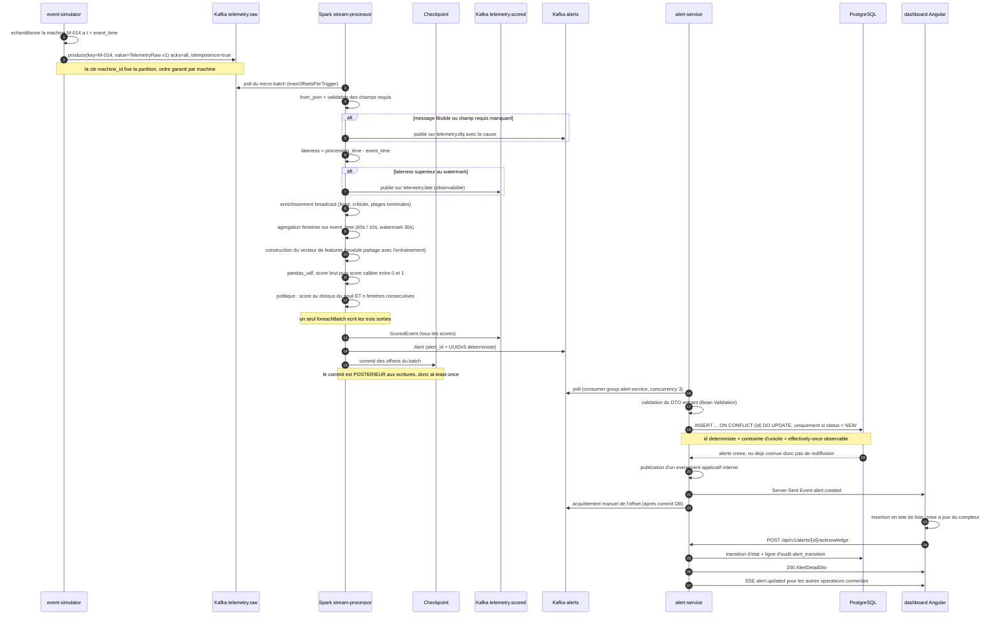

# 01 — Architecture

## 1. Vue d'ensemble

```mermaid
flowchart LR
    subgraph SIM["event-simulator (Python)"]
        GEN["Generateur de telemetrie<br/>machines + injection d'anomalies"]
    end

    subgraph KAFKA["Apache Kafka"]
        T1[["telemetry.raw<br/>6 partitions - cle machine_id"]]
        T2[["telemetry.scored<br/>6 partitions - cle machine_id"]]
        T3[["alerts<br/>3 partitions - cle machine_id"]]
        T4[["telemetry.dlq<br/>1 partition"]]
        T5[["telemetry.late<br/>1 partition"]]
        T6[["telemetry.labels<br/>3 partitions - cle machine_id"]]
    end

    subgraph SPARK["stream-processor (PySpark Structured Streaming)"]
        P1["Parse + validation<br/>from_json PERMISSIVE"]
        P2["Enrichissement<br/>broadcast join referentiel machines"]
        P3["Fenetrage temps d'evenement<br/>fenetre 60s / glissement 10s<br/>watermark 30s"]
        P4["Feature engineering<br/>module partage telemetry_core.features"]
        P5["Scoring<br/>pandas_udf + artefact sklearn"]
        P6["Politique d'alerte<br/>seuil + hysteresis + severite"]
        CKP[("Checkpoint<br/>offsets - commits - state")]
    end

    subgraph ML["ml-training (Python, hors ligne)"]
        M1["Extraction dataset<br/>replay telemetry.raw"]
        M2["Entrainement Pipeline sklearn<br/>Scaler + IsolationForest"]
        M3["Calibration du score (ECDF)<br/>+ seuil par budget d'alertes"]
        M4["Evaluation vs baseline<br/>+ profil de reference (drift)"]
    end

    ART[("Artefacts modeles<br/>volume partage<br/>model-vX.Y.Z.joblib + metadata.json")]

    subgraph SB["alert-service (Spring Boot 3, Java 17)"]
        C1["Kafka Listener<br/>consommateur idempotent"]
        C2["Couche application<br/>AlertApplicationService"]
        C3["Couche domaine<br/>machine a etats de l'alerte"]
        C4["Couche persistance<br/>Spring Data JPA + upsert natif"]
        C5["API REST /api/v1<br/>DTO + ProblemDetail"]
        C6["Flux SSE /api/v1/alerts/stream"]
    end

    PG[("PostgreSQL<br/>alert - machine - production_line<br/>alert_transition - model_version - drift_metric")]

    subgraph FE["dashboard (Angular + TypeScript)"]
        F1["Vue temps reel"]
        F2["Historique + filtres"]
        F3["Acquittement / cloture / faux positif"]
    end

    GEN -->|produce| T1
    GEN -.->|verite terrain, jamais lue par le modele| T6

    T1 --> P1 --> P2 --> P3 --> P4 --> P5 --> P6
    P1 -.->|message illisible| T4
    P1 -.->|retard hors watermark| T5
    P5 -->|tous les scores| T2
    P6 -->|score au dessus du seuil| T3
    SPARK <--> CKP

    T1 -.->|replay hors ligne| M1
    M1 --> M2 --> M3 --> M4 --> ART
    ART -.->|charge au demarrage du job| P5
    T6 -.->|jointure hors ligne sur event_id| M4

    T3 --> C1 --> C2 --> C3 --> C4 --> PG
    C2 --> C6
    PG --> C5
    C5 -->|REST| F2
    C5 -->|REST| F3
    C6 -->|Server-Sent Events| F1
    F3 -->|feedback operateur : faux positif| C2
    C2 -.->|republie l'etiquette humaine| T6

    ART -.->|metadonnees du modele| PG
```

## 2. Responsabilité de chaque composant

| Composant | Responsabilité unique | Ne fait pas |
|---|---|---|
| `event-simulator` | Produire un flux réaliste, injecter des anomalies **étiquetées** sur un topic séparé | Aucun calcul de feature, aucun scoring |
| `ml-training` | Produire un artefact versionné, immuable, auto-descriptif (modèle + calibration + seuil + profil de référence) | Ne tourne jamais en ligne |
| `stream-processor` | Fenêtrage temps d'événement, features, scoring, politique d'alerte | Ne persiste rien en base, ne connaît pas PostgreSQL |
| `alert-service` | Persistance, cycle de vie de l'alerte, API, diffusion temps réel | Ne calcule aucune feature, ne rescore rien |
| `dashboard` | Présentation et interaction opérateur | Aucune logique métier de sévérité |

Chaque frontière est un contrat versionné : topic Kafka + JSON Schema, ou API REST + DTO. Aucun composant ne
partage de table ni d'objet mutable avec un autre. C'est ce qui permet de redémarrer, remplacer ou réécrire un
composant sans toucher aux autres.

Un point mérite d'être explicité : **le calcul de sévérité appartient au `stream-processor`, pas au
`alert-service`**. Le service applicatif ne recalcule jamais un score ni une sévérité ; il reçoit une décision
et gère son cycle de vie. Cela évite d'avoir deux endroits où la règle métier de détection existe, donc deux
endroits qui peuvent diverger.

## 3. Parcours complet d'un événement

## 4. ADR-001 — Le scoring est embarqué dans Spark, pas appelé en HTTP

**Statut : accepté.** Alternative écartée : un service d'inférence (FastAPI / MLflow serving / Triton) appelé
par le job Spark.

### Pourquoi embarqué

1. **Les features n'existent que dans Spark.** Le vecteur scoré est une agrégation fenêtrée par machine,
   matérialisée dans le *state store* de Spark. Un service externe devrait soit recevoir la fenêtre complète à
   chaque appel (on transporte alors la partie coûteuse), soit maintenir son propre état — c'est-à-dire
   réimplémenter la partie difficile du système, en double, avec un risque permanent de divergence.
2. **Coût par événement contre coût par lot.** `pandas_udf` sérialise une partition entière via Apache Arrow et
   appelle `predict` une fois sur une matrice NumPy. Un appel HTTP par événement remplace un `predict`
   vectorisé par N allers-retours réseau, et la durée du micro-batch devient bornée par la **latence de queue**
   du service : un seul appel lent retarde tout le lot (effet *straggler*).
3. **Pas de domaine de panne supplémentaire.** Une dépendance HTTP dans un job de streaming impose de répondre
   à : que fait-on quand le service est indisponible ? Bloquer (le lag explose), abandonner (trou dans la
   couverture de détection), ou laisser passer non scoré (fausse sécurité). Aucune de ces réponses n'est
   satisfaisante. En embarqué, le modèle a exactement la disponibilité du job.
4. **Cohérence du backpressure.** Spark régule son propre débit via `maxOffsetsPerTrigger`. Un service externe
   introduit une file d'attente que Spark ne contrôle pas et dont il ne perçoit la saturation que par des
   timeouts.
5. **Auditabilité.** La version du modèle est figée pour la durée du job et publiée dans chaque événement scoré.
   Avec un service externe, deux événements du même batch peuvent être scorés par deux versions différentes si
   un déploiement a lieu entre-temps — et on ne peut plus expliquer une alerte a posteriori.
6. **Retries et effets de bord.** Les retries HTTP dans un pipeline at-least-once multiplient les appels ; si le
   service journalise ou facture les inférences, ses compteurs deviennent faux.

### Les limites, assumées

1. **Pas de hot-swap du modèle.** Changer de modèle impose de redémarrer le job. Pas de canary au niveau de la
   requête, pas de rollback instantané. *Atténuation* : le checkpoint reste valide car la topologie de la
   requête ne change pas (voir `docs/04-streaming-semantics.md`), donc le redémarrage est court et sans perte
   d'offsets.
2. **Couplage d'environnement Python.** L'artefact `joblib` doit être désérialisé par la **même version de
   scikit-learn** que celle de l'entraînement, sur chaque exécuteur. Une divergence peut, dans le pire cas,
   charger sans lever d'exception et produire des prédictions différentes. *Atténuation* : versions figées,
   empreinte SHA-256 de l'artefact et version de scikit-learn inscrites dans `metadata.json`, vérifiées au
   démarrage du job — échec explicite plutôt que dérive silencieuse ; image Docker de base commune à
   l'entraînement et aux exécuteurs.
3. **Aucune réutilisation.** Le modèle n'est pas appelable par un autre consommateur (application mobile,
   scoring à la demande, rejeu ad hoc). Un service d'inférence est un actif réutilisable ; l'embarqué ne l'est
   pas.
4. **Mise à l'échelle couplée.** Le coût CPU de l'inférence se paie dans les exécuteurs Spark. Impossible de
   dimensionner l'inférence indépendamment, ni de la placer sur GPU.
5. **Verrou technologique.** Cela ne fonctionne que parce que le moteur parle Python. Un job Spark en Scala ou
   un job Flink Java devrait passer par un export ONNX/PMML ou par un service.

### À quel moment je changerais d'avis

Dès qu'une de ces conditions devient vraie : inférence unitaire supérieure à ~10 ms, besoin de GPU, plus d'un
consommateur du modèle, ou cadence de déploiement du modèle supérieure à la cadence de redémarrage tolérable du
job. Étape intermédiaire avant le service HTTP : exporter le pipeline en **ONNX** et scorer dans la JVM, ce qui
supprime les workers Python sans introduire de saut réseau.

## 5. Choix d'exécution Spark pour le dépôt

`stream-processor` tourne en `local[*]` dans un unique conteneur pour la version 1 : un `docker compose up` doit
suffire sur une machine de développement. La conséquence est qu'on ne démontre pas la distribution réelle.
Le job est néanmoins écrit **sans aucune hypothèse de mono-exécuteur** (pas d'état Python global partagé entre
partitions, chargement du modèle par exécuteur via un singleton paresseux), ce qui permet de basculer sur un
master/worker Spark dans `docker-compose.cluster.yml` sans modifier le code. Voir D-11.
