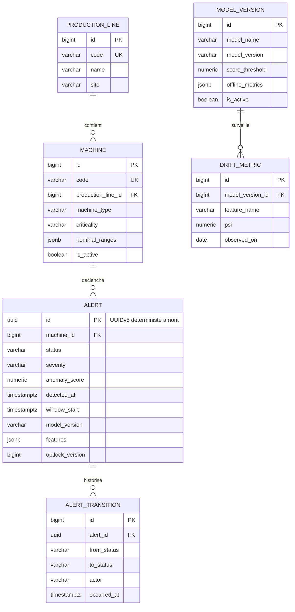

# 05 — Modèle relationnel PostgreSQL

> **Mise à jour Phase 4.** Le schéma réellement livré comporte **trois** tables — `machine`, `alert`,
> `alert_acknowledgement` — et non les six esquissées ici. `model_version` et `drift_metric` n'ont aucun
> producteur, `production_line` aucun attribut propre, et `criticality` / `commissioned_on` /
> `nominal_ranges` ne sont alimentées par rien. Les migrations font foi :
> `alert-service/src/main/resources/db/migration/`. Décision et justification :
> [D-38](09-open-decisions.md) et [ADR-007](adr/ADR-007-persistence-model.md).
>
> Ce qui suit reste la conception d'origine, conservée parce que ses sections 4.1 et 5 — le choix d'un UUID
> fourni par l'amont, et la requête d'upsert idempotent — sont celles qui ont effectivement été implémentées.

## 1. Périmètre : ce que la base contient, et ce qu'elle ne contient pas

PostgreSQL est la **source de vérité des alertes et du référentiel**. Il ne stocke **pas** la télémétrie brute.

Justification : à 20 machines × 1 Hz, la télémétrie représente environ 1,7 million de lignes par jour
(calcul de dimensionnement, pas une mesure). Une base relationnelle peut l'encaisser, mais elle n'est pas
l'outil adapté à une série temporelle — ni pour la compression, ni pour le sous-échantillonnage, ni pour la
rétention par tranche. La télémétrie vit dans Kafka pour sa fenêtre de rétention, et le bon outil de stockage
long terme serait TimescaleDB ou une base colonne. Le déclarer explicitement vaut mieux que de laisser une
table `telemetry` grossir jusqu'à ce que le dashboard devienne lent.

Le graphique temps réel du dashboard est alimenté par le flux SSE et conserve son historique **en mémoire du
navigateur** (fenêtre glissante de quelques minutes). L'historique persistant, c'est l'historique des alertes.

## 2. Schéma



## 3. DDL

Migrations gérées par **Flyway** (`V1__baseline.sql`, `V2__...`). Le schéma n'est jamais généré par Hibernate :
`spring.jpa.hibernate.ddl-auto=validate`. Hibernate vérifie que le modèle Java correspond au schéma et échoue
au démarrage sinon — la base est pilotée par des migrations relues et versionnées, pas par un effet de bord de
l'ORM.

```sql
-- V1__baseline.sql

CREATE TABLE production_line (
    id          BIGSERIAL     PRIMARY KEY,
    code        VARCHAR(32)   NOT NULL UNIQUE,
    name        VARCHAR(128)  NOT NULL,
    site        VARCHAR(64)   NOT NULL,
    created_at  TIMESTAMPTZ   NOT NULL DEFAULT now()
);

CREATE TABLE machine (
    id                  BIGSERIAL     PRIMARY KEY,
    code                VARCHAR(32)   NOT NULL UNIQUE,
    production_line_id  BIGINT        NOT NULL REFERENCES production_line (id),
    machine_type        VARCHAR(64)   NOT NULL,
    criticality         VARCHAR(16)   NOT NULL
        CONSTRAINT ck_machine_criticality CHECK (criticality IN ('LOW', 'MEDIUM', 'HIGH')),
    commissioned_on     DATE,
    nominal_ranges      JSONB         NOT NULL DEFAULT '{}'::jsonb,
    is_active           BOOLEAN       NOT NULL DEFAULT TRUE,
    created_at          TIMESTAMPTZ   NOT NULL DEFAULT now(),
    updated_at          TIMESTAMPTZ   NOT NULL DEFAULT now()
);
CREATE INDEX idx_machine_line ON machine (production_line_id);

CREATE TABLE model_version (
    id               BIGSERIAL    PRIMARY KEY,
    model_name       VARCHAR(64)  NOT NULL,
    model_version    VARCHAR(32)  NOT NULL,
    algorithm        VARCHAR(64)  NOT NULL,
    trained_at       TIMESTAMPTZ  NOT NULL,
    training_rows    BIGINT       NOT NULL,
    hyperparameters  JSONB        NOT NULL DEFAULT '{}'::jsonb,
    offline_metrics  JSONB        NOT NULL DEFAULT '{}'::jsonb,
    score_threshold  NUMERIC(7,6) NOT NULL,
    artifact_uri     TEXT         NOT NULL,
    artifact_sha256  CHAR(64)     NOT NULL,
    is_active        BOOLEAN      NOT NULL DEFAULT FALSE,
    created_at       TIMESTAMPTZ  NOT NULL DEFAULT now(),
    CONSTRAINT uq_model_version UNIQUE (model_name, model_version)
);
-- Un seul modele actif a la fois, garanti par la base et non par le code applicatif.
CREATE UNIQUE INDEX uq_model_single_active
    ON model_version (model_name) WHERE is_active;

CREATE TABLE alert (
    id                   UUID          PRIMARY KEY,
    machine_id           BIGINT        NOT NULL REFERENCES machine (id),
    status               VARCHAR(16)   NOT NULL DEFAULT 'NEW'
        CONSTRAINT ck_alert_status CHECK (status IN ('NEW', 'ACKNOWLEDGED', 'RESOLVED', 'DISMISSED')),
    severity             VARCHAR(16)   NOT NULL
        CONSTRAINT ck_alert_severity CHECK (severity IN ('MEDIUM', 'HIGH', 'CRITICAL')),
    anomaly_score        NUMERIC(7,6)  NOT NULL
        CONSTRAINT ck_alert_score CHECK (anomaly_score BETWEEN 0 AND 1),
    score_threshold      NUMERIC(7,6)  NOT NULL,
    detected_at          TIMESTAMPTZ   NOT NULL,
    window_start         TIMESTAMPTZ   NOT NULL,
    window_end           TIMESTAMPTZ   NOT NULL,
    published_at         TIMESTAMPTZ   NOT NULL,
    consecutive_windows  INTEGER       NOT NULL DEFAULT 1,
    model_name           VARCHAR(64)   NOT NULL,
    model_version        VARCHAR(32)   NOT NULL,
    features             JSONB         NOT NULL DEFAULT '{}'::jsonb,
    top_contributors     JSONB         NOT NULL DEFAULT '[]'::jsonb,
    ingested_at          TIMESTAMPTZ   NOT NULL DEFAULT now(),
    updated_at           TIMESTAMPTZ   NOT NULL DEFAULT now(),
    optlock_version      BIGINT        NOT NULL DEFAULT 0,
    CONSTRAINT ck_alert_window CHECK (window_end > window_start),
    CONSTRAINT uq_alert_natural
        UNIQUE (machine_id, window_start, model_name, model_version)
);

CREATE TABLE alert_transition (
    id               BIGSERIAL     PRIMARY KEY,
    alert_id         UUID          NOT NULL REFERENCES alert (id) ON DELETE CASCADE,
    from_status      VARCHAR(16),
    to_status        VARCHAR(16)   NOT NULL,
    actor            VARCHAR(128)  NOT NULL,
    comment          TEXT,
    root_cause_code  VARCHAR(64),
    occurred_at      TIMESTAMPTZ   NOT NULL DEFAULT now()
);

CREATE TABLE drift_metric (
    id                BIGSERIAL     PRIMARY KEY,
    model_version_id  BIGINT        NOT NULL REFERENCES model_version (id),
    observed_on       DATE          NOT NULL,
    feature_name      VARCHAR(128)  NOT NULL,
    psi               NUMERIC(10,6),
    ks_statistic      NUMERIC(10,6),
    observed_mean     DOUBLE PRECISION,
    observed_stddev   DOUBLE PRECISION,
    reference_mean    DOUBLE PRECISION,
    reference_stddev  DOUBLE PRECISION,
    sample_count      BIGINT        NOT NULL,
    computed_at       TIMESTAMPTZ   NOT NULL DEFAULT now(),
    CONSTRAINT uq_drift UNIQUE (model_version_id, observed_on, feature_name)
);
```

### Index

```sql
-- Vue par defaut du dashboard : la file de travail de l'operateur.
-- Index PARTIEL : seules les alertes ouvertes sont indexees. Les alertes cloturees
-- s'accumulent indefiniment et ne sont jamais lues par cette requete ; les exclure
-- garde l'index petit et stable dans le temps au lieu de le laisser croitre a vie.
CREATE INDEX idx_alert_open
    ON alert (detected_at DESC)
    WHERE status IN ('NEW', 'ACKNOWLEDGED');

-- Fiche machine : historique des alertes d'une machine.
CREATE INDEX idx_alert_machine_time ON alert (machine_id, detected_at DESC);

-- Frise chronologique globale et filtres sur periode.
CREATE INDEX idx_alert_detected_at ON alert (detected_at DESC);

-- Filtre par severite, croise avec la periode.
CREATE INDEX idx_alert_severity_time ON alert (severity, detected_at DESC);

-- Historique d'acquittement d'une alerte.
CREATE INDEX idx_transition_alert ON alert_transition (alert_id, occurred_at DESC);

-- Suivi de derive par modele et par date.
CREATE INDEX idx_drift_model_date ON drift_metric (model_version_id, observed_on DESC);
```

Ce qui n'est **pas** indexé, volontairement :

- **`features` (JSONB)** : pas d'index GIN. Un index GIN sur un JSONB écrit à chaque alerte coûte cher en
  écriture, et aucune requête du contrat REST ne filtre sur le contenu des features. On l'ajoutera le jour où
  une requête le justifiera — pas avant.
- **`status` seul** : sa cardinalité est de 4 valeurs. Sur une table où l'immense majorité des lignes finit en
  `RESOLVED`, un index B-tree sur cette colonne ne serait pas retenu par le planificateur. C'est précisément le
  rôle de l'index partiel ci-dessus.

## 4. Décisions de modélisation

### 4.1 `alert.id` est un UUID fourni par l'amont, pas une séquence

C'est le pivot de toute la stratégie d'idempotence (voir `docs/04-streaming-semantics.md` §4.3). Une séquence
`BIGSERIAL` générerait un identifiant différent à chaque rejeu, et la déduplication exigerait alors une table
technique `processed_message` avec sa propre gestion de purge.

Coût assumé : un UUIDv5 est un identifiant **aléatoire du point de vue de l'index B-tree**, donc les insertions
se dispersent dans l'arbre au lieu de s'ajouter en fin. À fort volume, cela fragmente l'index. UUIDv7 (ordonné
temporellement) supprimerait ce défaut, mais il n'est pas déterministe — et le déterminisme est ici plus
précieux que la localité d'insertion.

La contrainte `uq_alert_natural` est redondante avec la clé primaire puisque l'UUID dérive exactement de ces
colonnes. Elle est là volontairement : elle **documente dans le schéma** ce qui définit l'unicité d'une alerte,
et elle protège si un jour un producteur générait mal son UUID. Une invariante métier vérifiée par la base vaut
mieux qu'une invariante vérifiée seulement par le code qui écrit.

### 4.2 `VARCHAR` + `CHECK` plutôt que type `ENUM` PostgreSQL

Un `ENUM` PostgreSQL est plus élégant sur le papier. En pratique : ajouter une valeur exige un `ALTER TYPE`
qui, historiquement, ne pouvait pas s'exécuter dans une transaction, et le mapping Hibernate demande un
convertisseur. `VARCHAR` + `CHECK` se mappe directement sur `@Enumerated(EnumType.STRING)`, se lit sans
outillage, et une valeur se modifie par une simple migration de contrainte.

Le stockage en **chaîne et non en ordinal** est délibéré : un `@Enumerated(EnumType.ORDINAL)` transforme un
réordonnancement de l'énumération Java en corruption silencieuse de toutes les lignes existantes.

### 4.3 `alert_transition` : une table d'audit en ajout seul

L'énoncé demande un « historique d'acquittement ». Plutôt que des colonnes `acknowledged_by` /
`acknowledged_at` sur `alert`, chaque changement d'état produit une ligne immuable.

Trois raisons : on veut savoir **qui a fait quoi et quand**, y compris les allers-retours (acquittée, puis
requalifiée en faux positif) ; l'état courant sur `alert` reste une **projection** de cet historique, rapide à
lire ; et un audit en ajout seul ne se corrompt pas par une mise à jour concurrente.

`actor` est une chaîne libre : **il n'y a pas d'authentification dans la version 1**, l'identité vient du
dashboard. C'est une limite à assumer, pas à masquer — dans un vrai système ce serait une clé étrangère vers un
utilisateur, ou le `sub` d'un jeton OIDC. La colonne est dimensionnée pour accueillir cela sans migration.

### 4.4 Verrouillage optimiste sur `alert`

`optlock_version` est mappé par `@Version`. Deux opérateurs qui acquittent la même alerte simultanément
produiraient sans cela un « dernier écrit gagne » silencieux, et l'un des deux croirait avoir agi. Avec
`@Version`, le second reçoit une `OptimisticLockingFailureException`, traduite en **409 Conflict** avec l'état
courant, et son interface se rafraîchit.

Le nom `optlock_version` évite toute confusion avec `model_version` — deux notions de « version » sans rapport
dans la même table.

### 4.5 `features` en JSONB plutôt qu'en table normalisée

Une table `alert_feature (alert_id, name, value)` serait la forme normalisée. Elle multiplierait par ~30 le
nombre de lignes écrites par alerte, pour une donnée qui n'est **jamais requêtée par valeur** : elle est lue en
bloc, pour affichage et pour rejeu.

De plus, **l'ensemble des features change avec la version du modèle**. Un schéma figé serait faux dès le
premier ajout de feature. JSONB est ici le bon choix précisément parce que la structure est versionnée par
l'amont.

### 4.6 Tout en `TIMESTAMPTZ`

Aucune colonne en `TIMESTAMP` sans fuseau. `TIMESTAMPTZ` stocke un instant absolu en UTC ; `TIMESTAMP` stocke
un texte dont l'interprétation dépend de qui lit. Côté Java, le mapping est `Instant` — jamais
`LocalDateTime`, qui est le même piège dans l'autre langage.

## 5. Écriture depuis le consommateur Kafka

Le chemin d'ingestion n'utilise **pas** `JpaRepository.save()`. Raison : `save()` exécute un `SELECT` puis un
`INSERT` ou un `UPDATE`. Entre les deux, un autre thread peut insérer la même ligne — la contrainte d'unicité
rejette alors la transaction, et on convertit une opération censée être idempotente en erreur.

Le repository expose donc une requête native :

```sql
INSERT INTO alert (id, machine_id, status, severity, anomaly_score, score_threshold,
                   detected_at, window_start, window_end, published_at,
                   consecutive_windows, model_name, model_version, features, top_contributors)
VALUES (:id, :machineId, 'NEW', :severity, :anomalyScore, :scoreThreshold,
        :detectedAt, :windowStart, :windowEnd, :publishedAt,
        :consecutiveWindows, :modelName, :modelVersion,
        CAST(:features AS jsonb), CAST(:topContributors AS jsonb))
ON CONFLICT (id) DO UPDATE
   SET anomaly_score       = EXCLUDED.anomaly_score,
       severity            = EXCLUDED.severity,
       consecutive_windows = EXCLUDED.consecutive_windows,
       features            = EXCLUDED.features,
       top_contributors    = EXCLUDED.top_contributors,
       updated_at          = now()
 WHERE alert.status = 'NEW'
RETURNING (xmax = 0) AS inserted;
```

Deux subtilités qui méritent d'être défendues :

- **`WHERE alert.status = 'NEW'`** : une alerte déjà acquittée n'est jamais modifiée par un rejeu Kafka. Sans
  cette clause, un incident Spark renverrait dans la file de l'opérateur des alertes déjà traitées.
- **`RETURNING (xmax = 0)`** : `xmax` vaut 0 sur une ligne réellement insérée, non nul sur une ligne mise à
  jour. C'est ce qui permet de n'émettre l'événement SSE `alert.created` **que** pour une vraie création. Sans
  cela, chaque doublon ferait clignoter le dashboard.

Le reste du service (lecture, transitions d'état) passe par JPA normalement : ces opérations bénéficient du
suivi d'entité et du verrouillage optimiste.

## 6. Évolutions écartées pour la version 1

- **Partitionnement de `alert` par mois** (`PARTITION BY RANGE (detected_at)`) : justifié à partir de plusieurs
  millions de lignes, pour purger par `DROP PARTITION` plutôt que par `DELETE`. Prématuré ici, mais
  `detected_at` est déjà la bonne clé de partitionnement le jour venu.
- **Table de rollup `machine_score_minute`** : utile pour un historique de score au-delà de la fenêtre du
  navigateur. Ajoutée seulement si le besoin d'affichage se confirme — pas par anticipation.
- **Table `operator`** : dépend de l'introduction d'une authentification.
