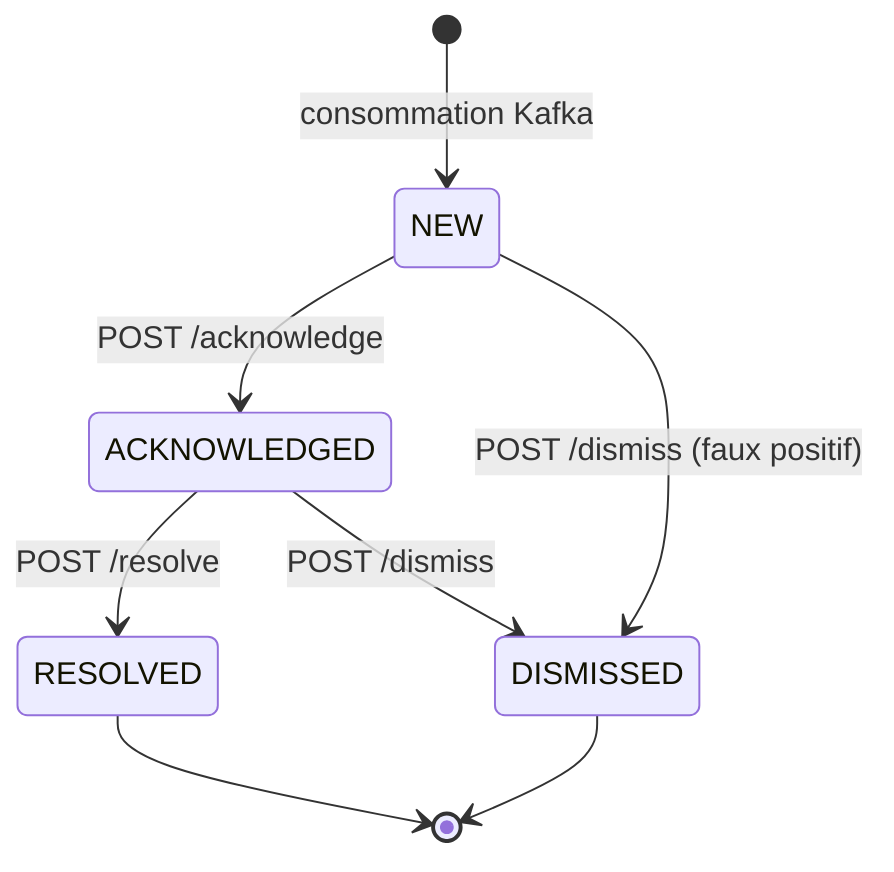

# 06 — Contrat REST du alert-service

Base : `/api/v1`. Représentation : `application/json`. Erreurs : `application/problem+json` (RFC 7807).
Toutes les dates sont en ISO-8601 UTC. Le versionnement est dans le chemin : c'est le plus lisible dans les
journaux et le plus simple à router, au prix d'un peu de duplication le jour d'une v2.

## 1. Machine à états de l'alerte



Toute transition non représentée renvoie **409 Conflict**. Les états terminaux ne sont pas réversibles : une
alerte close reste close, la trace d'une erreur d'appréciation ayant plus de valeur qu'une réécriture. Si
l'opérateur s'est trompé, l'alerte réapparaîtra au cycle suivant si l'anomalie persiste — c'est le
comportement souhaitable pour un système de détection continue.

## 2. Endpoints

### 2.1 Lister les alertes

```
GET /api/v1/alerts
```

| Paramètre | Type | Défaut | Notes |
|---|---|---|---|
| `status` | enum, répétable | tous | `NEW`, `ACKNOWLEDGED`, `RESOLVED`, `DISMISSED` |
| `severity` | enum, répétable | toutes | `MEDIUM`, `HIGH`, `CRITICAL` |
| `machineCode` | string | — | ex. `M-014` |
| `lineCode` | string | — | ex. `LINE-A` |
| `from` / `to` | date-time | — | bornes sur `detectedAt` (from incluse, to exclue) |
| `minScore` | number [0,1] | — | |
| `page` / `size` | int | 0 / 20 | `size` plafonné à 100 côté serveur |
| `sort` | string | `detectedAt,desc` | liste blanche : `detectedAt`, `anomalyScore`, `severity` |

`size` est **plafonné côté serveur** et `sort` restreint à une liste blanche. Laisser un client choisir
`size=100000` ou trier sur une colonne non indexée, c'est offrir un déni de service par requête légitime.

**200 OK**

```json
{
  "content": [
    {
      "id": "0b6d9a6f-2c9d-53a1-9f7e-4a10c8d2b7e5",
      "machineCode": "M-014",
      "lineCode": "LINE-A",
      "severity": "HIGH",
      "status": "NEW",
      "anomalyScore": 0.9962,
      "detectedAt": "2026-09-06T14:23:10Z",
      "topContributor": "vibration_mm_s_std",
      "acknowledgedBy": null,
      "version": 0
    }
  ],
  "page": { "number": 0, "size": 20, "totalElements": 143, "totalPages": 8 }
}
```

`AlertSummaryDto` ne contient **ni `features` ni `topContributors` complets** : une liste de 20 alertes
transporterait sinon 600 valeurs numériques inutilisées à l'affichage. Le détail est un appel séparé.

### 2.2 Détail d'une alerte

```
GET /api/v1/alerts/{id}
```

**200 OK** — `AlertDetailDto` : tous les champs du résumé, plus `scoreThreshold`, `windowStart`, `windowEnd`,
`publishedAt`, `consecutiveWindows`, `model {name, version, trainedAt}`, `features`, `topContributors[]`,
`machine {code, type, criticality, lineCode}`, `transitions[]`.

**404 Not Found** si l'identifiant est inconnu.

### 2.3 Acquitter

```
POST /api/v1/alerts/{id}/acknowledge
```

```json
{ "actor": "op.martin", "comment": "Intervention planifiee sur le roulement", "expectedVersion": 0 }
```

| Champ | Contrainte Bean Validation |
|---|---|
| `actor` | `@NotBlank @Size(max = 128)` |
| `comment` | `@Size(max = 2000)` |
| `expectedVersion` | `@NotNull @PositiveOrZero` |

| Code | Cas |
|---|---|
| **200** | acquittée, renvoie `AlertDetailDto` à jour |
| **400** | corps invalide → `problem+json` avec le détail par champ |
| **404** | alerte inconnue |
| **409** | statut incompatible, **ou** `expectedVersion` obsolète |

`expectedVersion` implémente un contrôle de concurrence optimiste **de bout en bout**, du chargement de
l'écran jusqu'à l'écriture. Sans lui, deux opérateurs qui traitent la même alerte produiraient un
« dernier écrit gagne » silencieux, et le premier croirait avoir agi. Le 409 renvoie l'état courant pour que le
client rafraîchisse sans nouvel aller-retour.

Alternative envisagée et écartée : `ETag` + `If-Match`. Plus conforme à HTTP, mais impose la gestion d'en-têtes
côté Angular pour un bénéfice identique dans une API strictement interne. Voir D-09.

### 2.4 Clôturer

```
POST /api/v1/alerts/{id}/resolve
```

```json
{
  "actor": "op.martin",
  "rootCauseCode": "BEARING_REPLACED",
  "comment": "Roulement cote accouplement remplace",
  "expectedVersion": 1
}
```

`rootCauseCode` est `@NotBlank`, contraint à une liste blanche configurable. C'est ce qui rend l'historique
exploitable statistiquement — un champ de commentaire libre ne l'est pas. Transition autorisée depuis
`ACKNOWLEDGED` uniquement : on ne clôture pas ce qu'on n'a pas pris en charge.

Codes : **200**, **400**, **404**, **409**.

### 2.5 Qualifier en faux positif

```
POST /api/v1/alerts/{id}/dismiss
```

```json
{ "actor": "op.martin", "reason": "Demarrage machine, vibration normale", "expectedVersion": 0 }
```

**Cet endpoint a un effet de bord assumé et important** : au-delà de la transition d'état, il publie un message
sur `telemetry.labels` avec `source: "OPERATOR"` et `is_anomaly: false`.

C'est la boucle de retour du système. Elle fournit la seule mesure de **précision en production** dont nous
disposions, en l'absence de vérité terrain (voir `docs/07-ml-methodology.md`). Sans cet endpoint, la question
« le modèle se dégrade-t-il ? » resterait sans réponse mesurable.

Conséquence architecturale à traiter : `alert-service` devient **producteur** Kafka en plus d'être
consommateur, et l'écriture en base et la publication Kafka ne sont pas dans la même transaction. Si la
publication échoue après le commit, l'étiquette est perdue. La réponse propre est le pattern **Transactional
Outbox** (écrire le message dans une table lors de la même transaction, puis le relayer). Pour la version 1,
la publication est faite après commit avec journalisation d'échec explicite, et la limite est documentée :
perdre une étiquette dégrade l'évaluation, elle ne corrompt pas l'état métier. C'est un compromis conscient,
pas un oubli.

### 2.6 Historique d'une alerte

```
GET /api/v1/alerts/{id}/history
```

**200 OK** — tableau de `AlertTransitionDto` `{ fromStatus, toStatus, actor, comment, rootCauseCode, occurredAt }`,
du plus récent au plus ancien.

### 2.7 Statistiques

```
GET /api/v1/stats/summary?from=&to=
```

```json
{
  "from": "2026-09-05T00:00:00Z",
  "to": "2026-09-06T00:00:00Z",
  "totalAlerts": 143,
  "byStatus":   { "NEW": 12, "ACKNOWLEDGED": 5, "RESOLVED": 118, "DISMISSED": 8 },
  "bySeverity": { "MEDIUM": 90, "HIGH": 41, "CRITICAL": 12 },
  "falsePositiveRate": 0.0559,
  "meanTimeToAcknowledgeSeconds": 214,
  "topMachines": [ { "machineCode": "M-014", "alertCount": 23 } ]
}
```

`falsePositiveRate` = `DISMISSED / (RESOLVED + DISMISSED)`. Le dénominateur **exclut volontairement** les
alertes non encore traitées : les inclure ferait mécaniquement chuter le taux à chaque pic d'alertes, ce qui
donnerait l'illusion d'une amélioration du modèle au moment précis où il se dégrade.

Toutes ces valeurs sont calculées à partir des données réellement présentes en base. Aucune n'est un objectif
ni une estimation.

### 2.8 Référentiel

```
GET /api/v1/machines
GET /api/v1/machines/{code}
GET /api/v1/machines/{code}/alerts     (memes filtres que 2.1)
GET /api/v1/models                      (versions de modele, metriques hors ligne, modele actif)
```

### 2.9 Flux temps réel (SSE)

```
GET /api/v1/alerts/stream
Accept: text/event-stream
```

Paramètres : `severity` (répétable), `lineCode`. Le filtrage est **côté serveur** : filtrer côté navigateur
oblige à transporter tout le flux à chaque client.

```
event: alert.created
data: {"id":"0b6d...","machineCode":"M-014","severity":"HIGH","anomalyScore":0.9962,"detectedAt":"2026-09-06T14:23:10Z"}

event: alert.updated
data: {"id":"0b6d...","status":"ACKNOWLEDGED","acknowledgedBy":"op.martin","version":1}

event: heartbeat
data: {"at":"2026-09-06T14:24:00Z"}
```

Le `heartbeat` toutes les 15 secondes n'est pas décoratif : sans trafic, un proxy ou un load balancer ferme une
connexion inactive au bout de 30 à 60 secondes, et le dashboard cesse silencieusement de se mettre à jour tout
en paraissant connecté. C'est le mode de panne le plus pernicieux d'un affichage temps réel.

Débit borné à un événement par machine et par seconde, les mises à jour intermédiaires étant fusionnées (voir
`docs/04-streaming-semantics.md` §5.5).

**Pourquoi SSE plutôt que WebSocket/STOMP** (D-08)

| | SSE | WebSocket + STOMP |
|---|---|---|
| Sens | serveur → client uniquement | bidirectionnel |
| Reconnexion | **native**, avec `Last-Event-ID` | à implémenter |
| Traversée de proxy | HTTP standard | négociation d'upgrade, parfois bloquée |
| Côté Spring | `SseEmitter`, aucune dépendance | `spring-boot-starter-websocket` + relais |
| Côté Angular | `EventSource` natif | `@stomp/rx-stomp` |

Le besoin est **strictement unidirectionnel** : le serveur pousse, le client agit par appels REST. WebSocket
offrirait un canal montant inutilisé, et STOMP ajouterait un protocole de messagerie par-dessus pour un seul
type d'abonnement.

La reconnexion native tranche : un dashboard d'atelier tourne des heures sur un poste dont le réseau vacille.
`EventSource` rétablit la connexion et renvoie `Last-Event-ID`, ce qui permet de rejouer les alertes manquées.
Avec WebSocket, cette logique est entièrement à écrire.

Limites à connaître et à assumer : **6 connexions par origine en HTTP/1.1** (sans objet ici, un onglet ouvre un
flux) et surtout, **en multi-instance, un client connecté à l'instance A ne reçoit pas les alertes consommées
par l'instance B**. La réponse serait un fan-out par Redis Pub/Sub ou un topic Kafka avec un groupe de
consommateurs par instance. En version 1, `alert-service` est mono-instance et c'est écrit noir sur blanc.

## 3. Gestion des erreurs

Un unique `@RestControllerAdvice` traduit les exceptions du domaine en `ProblemDetail` (natif Spring 6). Aucun
contrôleur ne construit de réponse d'erreur : sinon le format diverge d'un endpoint à l'autre, et un client
doit gérer plusieurs formes d'erreur.

```json
{
  "type": "https://api.anomaly-platform.local/problems/invalid-state-transition",
  "title": "Invalid alert state transition",
  "status": 409,
  "detail": "Alert 0b6d9a6f is RESOLVED and cannot be acknowledged",
  "instance": "/api/v1/alerts/0b6d9a6f-2c9d-53a1-9f7e-4a10c8d2b7e5/acknowledge",
  "traceId": "3f7a1c9e2b4d6081",
  "currentStatus": "RESOLVED",
  "currentVersion": 3
}
```

| Exception | Statut | `type` |
|---|---|---|
| `AlertNotFoundException` | 404 | `alert-not-found` |
| `InvalidStateTransitionException` | 409 | `invalid-state-transition` |
| `OptimisticLockingFailureException` | 409 | `concurrent-modification` |
| `MethodArgumentNotValidException` | 400 | `validation-failed` |
| `ConstraintViolationException` | 400 | `validation-failed` |
| `HttpMessageNotReadableException` | 400 | `malformed-request` |
| non gérée | 500 | `internal-error` |

Trois règles :

1. **Le `traceId` est présent dans toutes les erreurs**, corrélé au MDC des journaux. C'est ce qui permet de
   passer d'une capture d'écran d'utilisateur à la ligne de journal correspondante.
2. **Un 409 renvoie l'état courant** (`currentStatus`, `currentVersion`) : le client peut se resynchroniser
   sans requête supplémentaire.
3. **Un 500 n'expose jamais de trace d'exception**. Une trace en réponse HTTP divulgue la structure interne, et
   le seul destinataire utile de cette information, ce sont les journaux du serveur.

## 4. Ce que l'API ne fait pas

- **Pas de suppression d'alerte.** Aucun `DELETE`. Un enregistrement de détection est un fait ; on le clôture,
  on ne l'efface pas.
- **Pas de création d'alerte par REST.** Les alertes viennent exclusivement de Kafka. Un second chemin
  d'écriture dupliquerait les règles de validation et de calcul de sévérité.
- **Pas de modification du score ni de la sévérité.** Ce sont des sorties de modèle, pas des champs éditables.
  Un opérateur en désaccord utilise `dismiss`, et son verdict devient une étiquette — la bonne façon de
  contester un modèle est de l'alimenter, pas de réécrire sa sortie.
- **Pas d'authentification en version 1.** L'API est exposée sur le réseau Docker interne. C'est une limite
  explicite ; l'ajout se ferait par Spring Security + JWT, avec `actor` dérivé du jeton au lieu du corps de
  requête.
