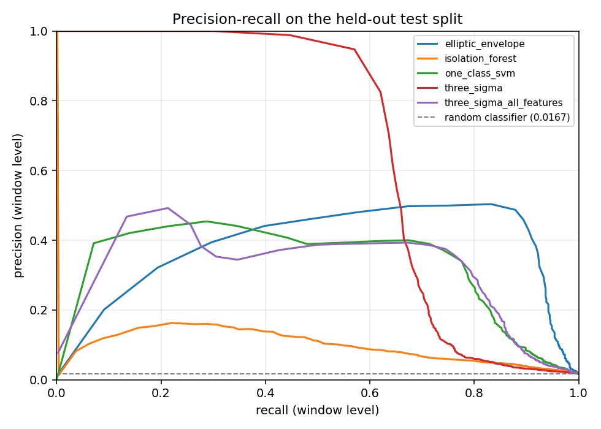

# Phase 2 — Anomaly detector: dataset, models, results

Generated on 2026-09-07T00:36:44.918Z by `ml-training 0.1.0`.
Every figure below is read from `reports/results.json`, which is written by an
actual training run. Nothing here is hand-entered.

## 1. Dataset

Generated by `event-simulator` in replay mode, exported from Kafka as a bounded
snapshot, and identified by its digest.

| | |
|---|---|
| Telemetry topic | `telemetry.raw` |
| Label topic | `telemetry.labels` |
| Telemetry rows | 2591998 |
| Duplicates removed on `event_id` | 0 |
| Decode failures | 0 telemetry, 0 labels |
| Label rows | 33579 |
| Machines | 15 |
| Event time span | 2026-09-05T00:10:10.707Z → 2026-09-07T00:10:09.707Z |
| Simulator seed | 424242 |
| `samples.parquet` SHA-256 | `301c7ce070465afe069255b67d00d480317c0db7ef48a0eafede5728b4ac5a61` |
| `labels.parquet` SHA-256 | `9cd1d53fbad964490375ff16fc3eb0ebfc689e588c03f4f7e8b18beb70067ab2` |

`telemetry.raw` provides the features and nothing else. `telemetry.labels` is
used only to evaluate and to calibrate the threshold; it never enters the
matrix a model is fitted on.

### Splits — temporal, never random

Two windows either side of a random cut are near-identical, which is a leak. The
cut is applied to the samples **before** windowing, so no window straddles a
boundary.

| Split | Windows | Machines | Hours | Anomalous windows | Prevalence | Episodes |
|---|---|---|---|---|---|---|
| train | 21178 | 15 | 27.98 | 254 | 0.0120 | 126 |
| validation | 45052 | 15 | 10.00 | 944 | 0.0210 | 52 |
| test | 45460 | 15 | 10.00 | 759 | 0.0167 | 42 |


Training uses tumbling 60 s windows; validation and
test use the 60 s / 10 s
sliding cadence of the streaming job, so the measured alert rate is the rate an
operator would actually see.

A window counts as anomalous when at least
25% of its samples are.

**On prevalence.** Precision depends directly on how common anomalies are. The
test split's prevalence is 0.0167;
at a lower prevalence the same detector would show lower precision at the same
threshold. Any precision figure below should be read together with that number.

## 2. Features

52 features, specification version `2.0.0`,
defined once in `telemetry_core.features` and translated to pandas here. The
translation is checked against the reference implementation by
`tests/test_feature_conformance.py`, which is the mechanism that will let the
Spark job in Phase 3 claim the same semantics.

Covered families: rolling means, rolling standard deviations, deviation from the
moving average (raw and normalised), rate of change, and cross-sensor
correlations — plus per-sample derived ratios and two data-quality features.

## 3. Models

All candidates share the same pipeline — per-machine robust normalisation,
median imputation with missingness indicators, standardisation — so a difference
in results is a difference between models rather than between preprocessing. The
baseline is deliberately not handicapped.

| Model | Role | Fit (s) | Test PR-AUC | Test precision | Test recall | Test F1 | Episode recall | Alerts/machine/h |
|---|---|---|---|---|---|---|---|---|
| `elliptic_envelope` | exploratory | 8.46 | 0.3812 | 0.5020 | 0.8076 | 0.6192 | 1.0000 | 0.387 |
| `isolation_forest` | mandatory | 1.05 | 0.0991 | 0.1014 | 0.0567 | 0.0727 | 0.4286 | 0.160 |
| `one_class_svm` | mandatory | 0.41 | 0.3369 | 0.4461 | 0.2345 | 0.3074 | 0.8810 | 0.493 |
| `three_sigma` | mandatory baseline | 0.31 | 0.6704 | 0.9839 | 0.4822 | 0.6472 | 0.4286 | 0.127 |
| `three_sigma_all_features` | secondary | 0.31 | 0.3424 | 0.4894 | 0.2134 | 0.2972 | 0.7381 | 0.453 |


### Candidates excluded from selection

- `elliptic_envelope`: rank-deficient covariance (45 of 47 columns): the Mahalanobis distance rests on a matrix that cannot be inverted reliably
- `three_sigma_all_features`: secondary variant, reported for comparison only

`three_sigma` sees only the five raw sensor means, which is the rule a plant
already has without any feature engineering. `three_sigma_all_features` is the
same rule given the full feature set; the gap between the two isolates what the
feature engineering contributes, separately from the choice of estimator.

`elliptic_envelope` needs two exclusions, and only the first was anticipated.
`range = max - min` is an exact linear combination, so the covariance becomes
rank-deficient. Measurement then showed a second cause: `sample_count` is
constant for every complete window once the admission gate has run, and a
zero-variance column makes the determinant zero and the condition number
infinite. The detector therefore drops zero-variance columns at fit time as a
general guard rather than a hard-coded list.

scikit-learn does not refuse a singular covariance -- it warns and proceeds --
which is worse than failing, because the model then loads and scores as if
nothing were wrong. So the result is measured rather than assumed:

Fitted covariance: 45 of 47 columns full rank, condition number 3.284e+47, 0 dependent column(s) dropped before fitting.

### One-Class SVM: measured cost, not asserted cost

| Training rows | Fit seconds | Support vectors |
|---|---|---|
| 1000 | 0.03 | 72 |
| 2000 | 0.06 | 118 |
| 4000 | 0.14 | 216 |
| 8000 | 0.37 | 416 |


Inference cost is proportional to the number of support vectors, which is what
matters for a job that scores every window of every machine continuously.



## 4. Threshold

Chosen on **validation**, never on test, and chosen from an alert budget rather
than from the F1 maximum.

| | Quantile | Threshold | Alerts/machine/h | Window F1 | Episode recall |
|---|---|---|---|---|---|
| Budget-selected | 0.99 | 0.9928 | 0.493 | 0.3312 | 0.8462 |
| F1-maximising | 0.97 | 0.9751 | 0.667 | 0.5540 | 0.9808 |

The budget is 0.5 alert events per
machine per hour. An alert event is a run of at least two consecutive windows
above the threshold on one machine, so one degradation counts once rather than
once per window — which is what an operator receives.

The four detectors produce scores on incomparable scales (an isolation depth, a
distance to a kernel boundary, a maximum z-score). An empirical CDF fitted on
the **training** scores maps each onto its rank in that reference distribution,
so the same quantile means the same nominal alert budget for every model.

### Operating points on validation — selected model

| Quantile | Threshold | Alert events/h | Per machine/h | Window precision | Window recall | Episode recall | Median latency (s) |
|---|---|---|---|---|---|---|---|
| 0.9 | 0.8934 | 69.00 | 4.600 | 0.1782 | 0.8506 | 1.0000 | 30.3 |
| 0.95 | 0.9554 | 26.50 | 1.767 | 0.3333 | 0.7956 | 1.0000 | 32.3 |
| 0.97 | 0.9751 | 10.00 | 0.667 | 0.4704 | 0.6737 | 0.9808 | 60.3 |
| 0.98 | 0.9843 | 8.80 | 0.587 | 0.5022 | 0.4799 | 0.9808 | 61.3 |
| 0.99 | 0.9928 | 7.40 | 0.493 | 0.5122 | 0.2447 | 0.8462 | 66.3 |
| 0.993 | 0.9960 | 6.30 | 0.420 | 0.4557 | 0.1525 | 0.6731 | 75.3 |
| 0.995 | 0.9974 | 5.50 | 0.367 | 0.4292 | 0.1028 | 0.5769 | 132.3 |
| 0.997 | 0.9986 | 4.60 | 0.307 | 0.3824 | 0.0551 | 0.4038 | 75.3 |
| 0.998 | 0.9990 | 3.30 | 0.220 | 0.2857 | 0.0275 | 0.2500 | 287.3 |
| 0.999 | 1.0000 | 1.50 | 0.100 | 0.1304 | 0.0064 | 0.0577 | 52.3 |
| 0.9995 | 1.0000 | 0.10 | 0.007 | 0.0690 | 0.0021 | 0.0192 | 29.3 |
| 0.9999 | 1.0000 | 0.10 | 0.007 | 0.0690 | 0.0021 | 0.0192 | 29.3 |


## 5. Results for the selected model: `one_class_svm`

Measured once on the held-out test split, with the threshold already frozen.

| | |
|---|---|
| Threshold (calibrated) | 0.9928 |
| Window precision | 0.4461 |
| Window recall | 0.2345 |
| Window F1 | 0.3074 |
| PR-AUC (average precision) | 0.3369 |
| Confusion matrix | TP 178, FP 221, TN 44480, FN 581 |
| Episodes on test | 44 total, 42 scorable |
| Episodes detected | 37 |
| Episode recall | 0.8810 |
| Median detection latency | 60.3 s |

PR-AUC rather than ROC-AUC: with a small minority of anomalous windows the
false-positive rate barely moves, and ROC-AUC flatters even a weak model.

Episodes that overlap no scorable window are excluded from the recall
denominator. A fault occurring entirely while a machine is stopped is
undetectable by design, and charging it to the model would flatter whoever chose
the admission rule.

### False positives

221 false positives,
0.5539 of all
alerts at this threshold.

By machine: `{'M-014': 26, 'M-005': 25, 'M-012': 19, 'M-008': 17, 'M-009': 16, 'M-003': 15, 'M-002': 15, 'M-011': 14, 'M-010': 13, 'M-007': 13}`

By machine state: `{'RUNNING': 164, 'MAINTENANCE': 42, 'IDLE': 10, 'STARTING': 5}`

### Missed episodes

| Anomaly type | Episodes | Detected | Missed | Recall |
|---|---|---|---|---|
| `BEARING_WEAR` | 13 | 13 | 0 | 1.0000 |
| `MOTOR_STALL` | 5 | 4 | 1 | 0.8000 |
| `OVERHEAT` | 4 | 1 | 3 | 0.2500 |
| `POWER_SURGE` | 4 | 4 | 0 | 1.0000 |
| `PRESSURE_DROP` | 7 | 6 | 1 | 0.8571 |
| `SENSOR_DROPOUT` | 4 | 4 | 0 | 1.0000 |
| `SENSOR_STUCK` | 5 | 5 | 0 | 1.0000 |


Median duration of a missed episode:
10.0 s,
against 106.0 s
for detected ones.

## 6. Secondary experiment: training on label-filtered data

Not the main protocol. Filtering the training set by the labels uses information
production does not have, so any gain it shows is unavailable in practice
(decision D-27). Measured to put a number on the gap rather than leave it as an
assertion.

Both columns use the **same estimator** (`one_class_svm`), so the
difference is the effect of the filter and not of a change of model.

| | Contaminated (main) | Label-filtered (secondary) |
|---|---|---|
| Training rows | 8000 | 8000 |
| Anomalous rows removed | 0 | 254 |
| Test precision | 0.4461 | 0.5134 |
| Test recall | 0.2345 | 0.5296 |
| Test F1 | 0.3074 | 0.5214 |
| Test episode recall | 0.8810 | 0.8333 |

## 7. Reproducibility

| | |
|---|---|
| Training seed | 20260907 |
| Python | 3.11.16 |
| scikit-learn | 1.5.2 |
| NumPy | 2.1.3 |
| pandas | 2.2.3 |
| Feature set | `2.0.0` |
| Dataset | `/workspace/data/run-01`, samples SHA-256 `301c7ce070465afe…` |
| Artefact | `artifacts/one_class_svm/2.0.0`, SHA-256 `0f608323f944e63d…` |

```sh
# 1. generate the history (same seed => same data)
docker run --rm --network anomaly-platform_anomaly-net \
  -e KAFKA_BOOTSTRAP_SERVERS=kafka:9092 event-simulator \
  python -m event_simulator.main --mode replay \
  --duration-seconds 108000 --seed 424242

# 2. snapshot it
docker run --rm --network anomaly-platform_anomaly-net \
  -e KAFKA_BOOTSTRAP_SERVERS=kafka:9092 ml-training \
  python -m ml_training.cli export --destination /workspace/data/run-01 \
  --source-seed 424242

# 3. train, evaluate, write the artefact and this report
docker run --rm ml-training python -m ml_training.cli train \
  --dataset /workspace/data/run-01 --seed 20260907
```

## 8. Limits

* The ground truth comes from a simulator we wrote. The guards against a
  complacent generator are in `docs/07-ml-methodology.md`, and the mandatory
  trivial baseline in the table above is the main one: if the baseline is not
  clearly beaten, the machine learning earns nothing here.
* Precision is reported at the measured prevalence and does not transfer to a
  plant with a different one.
* The threshold is calibrated globally. Per-machine thresholds would handle
  fleet heterogeneity better but need a history per machine and turn operations
  into managing as many thresholds as there are machines (decision D-07).
* Short spikes are diluted in a 60 s window by construction. The missed-episode
  table shows which anomaly types this costs.
* Unpickling the artefact requires `ml_training.models` to be importable,
  because the per-machine normaliser is a custom transformer. Phase 3 either
  installs this package or the inference classes move to a small shared library.

## 9. Next steps for the Spark integration

1. Translate the feature specification to Spark SQL, using `min_by`/`max_by`
   for every "first"/"last" — `first()`/`last()` are non-deterministic after a
   shuffle and would make the conformance test fail intermittently.
2. Reuse `tests/test_feature_conformance.py` as the template: same reference,
   same tolerance, same random windows.
3. Load the artefact once per executor behind a lazy singleton, checking the
   SHA-256, the scikit-learn version and the feature-set version at startup — a
   mismatch must fail the job, not change the scores quietly.
4. Apply the admission gate before scoring, and publish a `skip_reason` for
   windows that are not scored, so a scoring outage never looks like a healthy
   plant.
